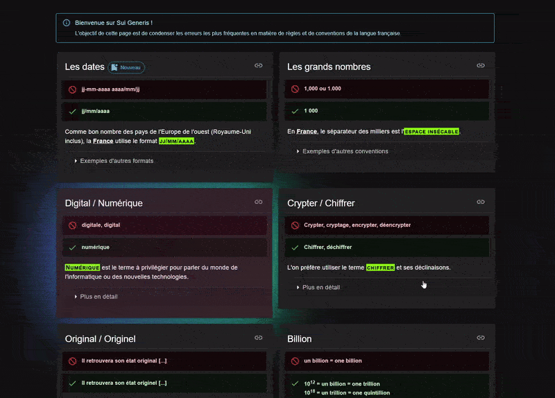

> [!NOTE]  
> Sui Generis condense les erreurs les plus fréquentes en matière de règles et de conventions de la langue française.

 

🖱 👉 **[Philjbt.github.io/SuiGeneris/](https://philjbt.github.io/SuiGeneris/#digital)**

 

